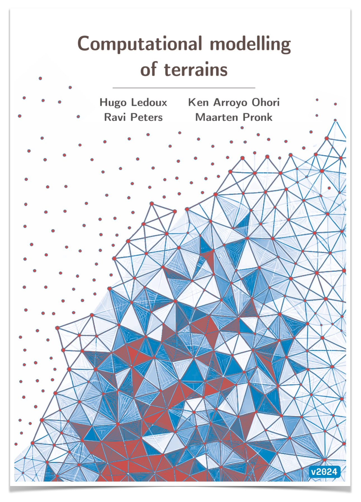

  

# Computational modelling of terrains

The book *Computational modelling of terrains* presents an overview of algorithms and methodologies to reconstruct terrains, to manipulate them, and to extract information from them.
It covers different representations of terrains (eg TINs, rasters, point clouds, contour lines), discusses different applications (visibility analysis, runoff modelling, etc.), presents techniques to handle large datasets, and discusses related topics such as global elevation models and bathymetric datasets.

The book is currently used for the course [Digital terrain modelling (GEO1015)](https://3d.bk.tudelft.nl/courses/geo1015/) in the [MSc Geomatics at the Delft University of Technology](http://geomatics.tudelft.nl) in the Netherlands.
The course is tailored for MSc students who have already followed an introductory course in GIS and in programming.

Each chapter is a lesson in the course, and each lesson is accompanied by a video introducing the key ideas and/or explaining some parts of the lessons.

## Authors

* [@hugoledoux](https://github.com/hugoledoux/)
* [@kenohori](https://github.com/kenohori/)
* [@ylannl](https://github.com/ylannl/)
* [@evetion](https://github.com/evetion/) 

## PDF version

[The latest version of the book in PDF can be downloaded here](https://github.com/tudelft3d/terrainbook/releases)

## Errors? Feedback?

Please report errors, typos, and suggestions for improvements [as issues](https://github.com/tudelft3d/terrainbook/issues).

## Videos and extra material

Most chapters have a short YouTube video explaining the key concepts, and some chapters have extra material. Available at [https://tudelft3d.github.io/terrainbook/](https://tudelft3d.github.io/terrainbook/)

## Open material

This work is licensed under a <a rel="license" href="http://creativecommons.org/licenses/by/4.0/">Creative Commons Attribution 4.0 International License.
