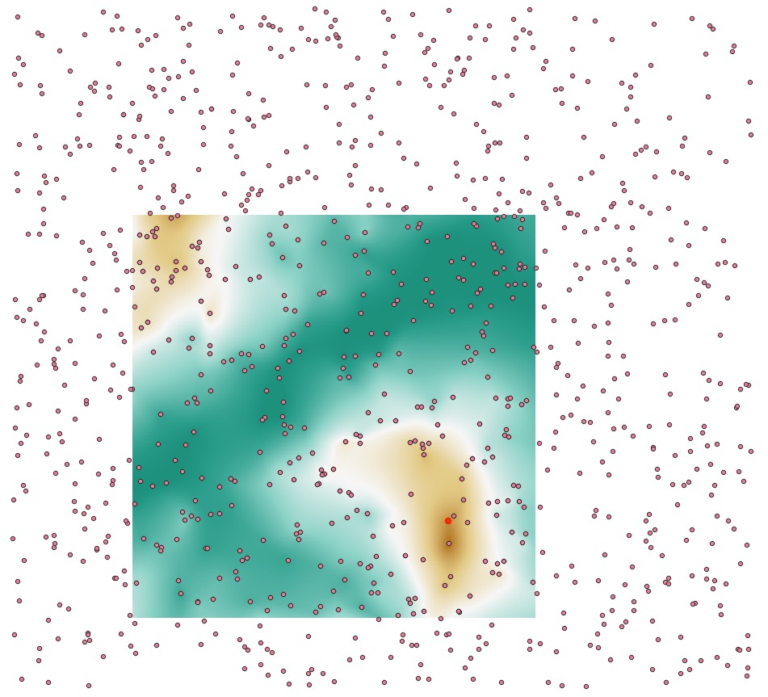
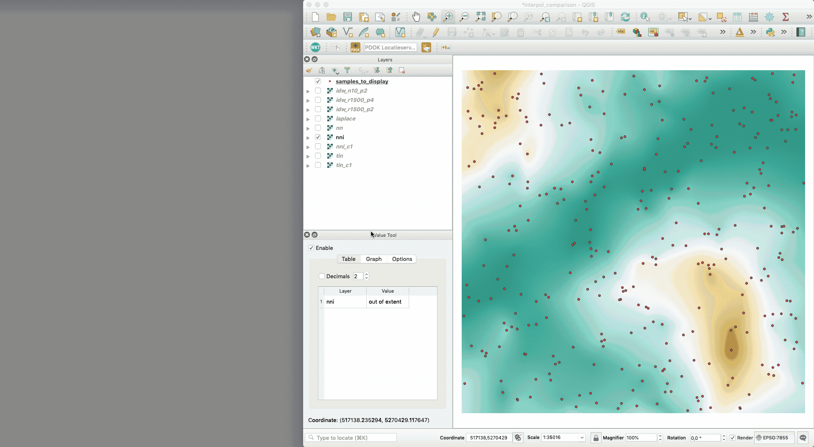

## Comparison of interpolation methods

<a href="./interpol_comparison.zip"><i class="fa fa-download"></i> interpol_comparison.zip</a> (use QGIS3 and open the project file `interpol_comparison.qgz`)

The original samples are in the CSV file `samples.xyz`, a real gridded terrain in Tasmania (Australia) was randomly sampled with points that are far from each other.

Then, to ensure that no artefacts are created at the border of the dataset, an area in the middle of that dataset was chosen to perform interpolation with different methods.

All methods were used exactly at the same locations (centre of pixels).
The output files contain the name of the method, and eventually the parameters used.
The interpolation methods used are:

  1. __IDW__: (inverse distance to a power); `r1500` == radius of 1500units; `n10` == 10 closest neighbours; `p2` == power of2
  2. __laplace__
  3. __nn__: nearest neighbour
  4. __nni__: natural neighbour (linear version)
  5. __nni_c1__: natural neighbour (C^1)
  6. __tin__: linear interpolation in a (Delaunay) TIN
  7. __tin__: C^1 interpolant in a (Delaunay) TIN

The best way to visualise the results is to use the plugin [qgis2threejs](https://qgis2threejs.readthedocs.io/en/docs/) and use the 3D view as an alternative for the QGIS3 3D-view, it is far more stable and robust for me.
You can zoom in/out, and select interactively which datasets to display.

